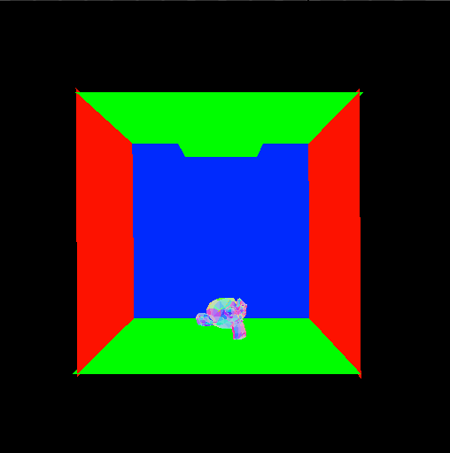

# NanoRT, single header only modern ray tracing kernel.



`NanoRT` is simple single header only ray tracing kernel.

`NanoRT` BVH traversal is based on mallie renderer: https://github.com/lighttransport/mallie

## Features

* Portable C++
  * Does not require C++11 compiler.
* BVH spatial data structure for efficient ray intersection finding.
  * Should be able to handle ~10M triangles scene efficiently with moderate memory consumption
* Triangle mesh only.
  * Facevarying attributes(tex coords, vertex colors, etc)
* Cross platform
  * MacOSX, Linux, Windows, ARM, x86, MIPS, etc.

## Applications

* test renderer for your light trasport algorithm development.
* test renderer for your shader language development.
* Add 2D/3D rendering feature for non-GPU system.

## API

`nanort::Ray` represents ray.
`nanort::Intersection` stores intersection information. `.t` must be set to max distance(e.g. 1.0e+30f) before ray traversal.
`nanort::BVHAccel` builds BVH data structure from geometry, and provides the function to find intersection point for a given ray.

```
typedef struct {
  float t;             // [inout] hit distance.
  float u;             // [out] varycentric u of hit triangle.
  float v;	       // [out] varicentric v of hit triangle.
  unsigned int faceID; // [out] face ID of hit triangle.
} Intersection;

typedef struct {
  float org[3];   // [in] must set
  float dir[3];   // [in] must set
  float invDir[3];// filled internally
  int dirSign[3]; // filled internally
} Ray;

nanort::BVHBuildOptions options; // BVH build option
nanort::BVHAccel accel;
accel.Build(vertices, faces, numFaces, options);

nanort::Intersection isect;
isect.t = 1.0e+30f;

nanort::Ray ray;
// fill ray org and ray dir.

bool hit = accel.Traverse(isect, mesh.vertices, mesh.faces, ray);
```

Application must prepare geometric information and store it in linear array.

* `vertices` : The array of triangle vertices(xyz * numVertices)
* `faces` : The array of triangle face indices(3 * numFaces)
* uvs, normals, custom vertex attributes : We recommend the application define vertex attributes as facevarying.


## Usage

    // Do this only for *one* .cc file.
    #define NANORT_IMPLEMENTATION
    #include "nanort.h"

    Mesh mesh;
    // load mesh data...

    nanort::BVHBuildOptions options; // Use default option

    printf("  BVH build option:\n");
    printf("    # of leaf primitives: %d\n", options.minLeafPrimitives);
    printf("    SAH binsize         : %d\n", options.binSize);

    nanort::BVHAccel accel;
    ret = accel.Build(mesh.vertices, mesh.faces, mesh.numFaces, options);
    assert(ret);

    nanort::BVHBuildStatistics stats = accel.GetStatistics();

    printf("  BVH statistics:\n");
    printf("    # of leaf   nodes: %d\n", stats.numLeafNodes);
    printf("    # of branch nodes: %d\n", stats.numBranchNodes);
    printf("  Max tree depth   : %d\n", stats.maxTreeDepth);
 
    std::vector<float> rgb(width * height * 3, 0.0f);

    // Shoot rays.
    #ifdef _OPENMP
    #pragma omp parallel for
    #endif
    float tFar = 1.0e+30f;
    for (int y = 0; y < height; y++) {
      for (int x = 0; x < width; x++) {
        nanort::Intersection isect;
        isect.t = tFar;

        // Simple camera. change eye pos and direction fit to .obj model. 

        nanort::Ray ray;
        ray.org[0] = 0.0f;
        ray.org[1] = 5.0f;
        ray.org[2] = 20.0f;

        float3 dir;
        dir[0] = (x / (float)width) - 0.5f;
        dir[1] = (y / (float)height) - 0.5f;
        dir[2] = -1.0f;
        dir.normalize();
        ray.dir[0] = dir[0];
        ray.dir[1] = dir[1];
        ray.dir[2] = dir[2];

        bool hit = accel.Traverse(isect, mesh.vertices, mesh.faces, ray);
        if (hit) {
          // Write your shader here.
          float3 normal;
          unsigned int fid = isect.faceID;
          normal[0] = mesh.facevarying_normals[3*3*fid+0]; // @todo { interpolate normal }
          normal[1] = mesh.facevarying_normals[3*3*fid+1];
          normal[2] = mesh.facevarying_normals[3*3*fid+2];
          // Flip Y
          rgb[3 * ((height - y - 1) * width + x) + 0] = fabsf(normal[0]);
          rgb[3 * ((height - y - 1) * width + x) + 1] = fabsf(normal[1]);
          rgb[3 * ((height - y - 1) * width + x) + 2] = fabsf(normal[2]);
        }

      }
    }

## More example

See `example` directory for example renderer using `NanoRT`.

## License

MIT license.

## TODO

* [x] Set eplision value according to scene's bounding box size(BVHTraverse).
* [x] OpenMP multithreaded BVH build.
* [ ] Robust intersection calculation.
* [ ] Scene graph support.
